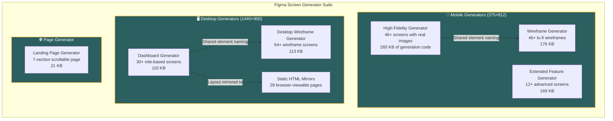
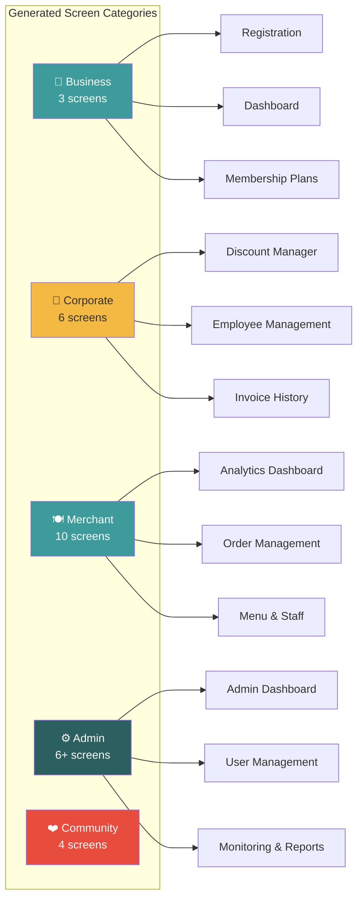
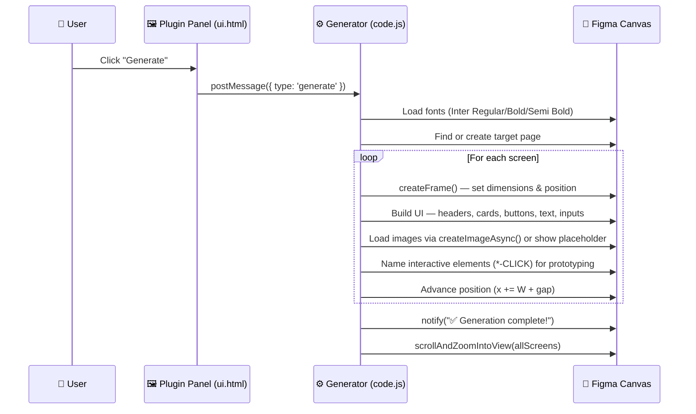
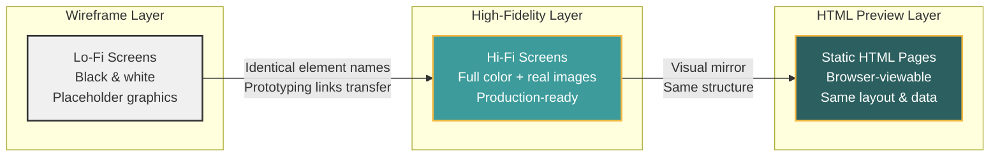

<p align="center">
  
  
  
  
</p>

<h1 align="center">⚡ Figma Screen Generator</h1>

<p align="center">
  <b>Generate hundreds of production-ready Figma screens entirely through code.<br/>No manual dragging. No component libraries. Just JavaScript → full UI.</b>
</p>

<p align="center">
  <a href="#-what-this-does">What This Does</a> •
  <a href="#-architecture">Architecture</a> •
  <a href="#-plugin-modules">Modules</a> •
  <a href="#-how-it-works">How It Works</a> •
  <a href="#-getting-started">Getting Started</a> •
  <a href="#-capabilities">Capabilities</a>
</p>

---

## 🧠 What This Does

This project demonstrates **programmatic UI generation inside Figma** — using the Figma Plugin API to create complete, pixel-perfect screens from pure JavaScript. Instead of manually designing each screen, you write code that:

- 🖼️ **Creates frames, shapes, text, and images** at precise coordinates
- 🎨 **Applies design tokens** (colors, typography, spacing) consistently
- 🔗 **Names elements for prototyping** so screens are immediately interactive
- 📱 **Handles both mobile (375×812) and desktop (1440×900)** layouts
- 🖼️ **Loads real images from URLs** (Unsplash) with graceful fallbacks
- 📐 **Auto-positions screens** in organized rows and columns on the canvas

> **Currently optimized for:** Food delivery / restaurant platform screens (customer, merchant, corporate, admin flows). The architecture and helper system is fully reusable for any domain.

---

## 🏗️ Architecture



---

## 📂 Project Structure

```
├── 📱 figma - app - high fid/     # Hi-Fi Mobile Screen Generator
│   ├── code.js                     # 6,967 lines — generates 46+ screens with images
│   ├── ui.html                     # Plugin control panel
│   └── manifest.json               # Figma plugin config
│
├── 📱 figma - app/                 # Extended Feature Generator
│   ├── code.js                     # 4,665 lines — group orders, split pay, pickup
│   ├── ui.html
│   └── manifest.json
│
├── 📱 app wireframes/              # Mobile Wireframe Generator
│   ├── code.js                     # 5,303 lines — lo-fi versions, same element names
│   ├── ui.html
│   └── manifest.json
│
├── 🖥️ figma - pc/                  # Desktop Dashboard Generator
│   ├── code.js                     # 2,465 lines — business, merchant, admin screens
│   ├── code - backup.js            # 3,757 lines — full version with live images
│   ├── manifest.json               # Includes networkAccess for image loading
│   ├── pages/                      # 29 static HTML mirrors of generated screens
│   │   ├── index.html              # Hub page linking all screen previews
│   │   ├── assets/style.css        # Shared CSS design system
│   │   └── *.html                  # Individual screen pages
│   └── ui.html
│
├── 🖥️ pc wireframes/               # Desktop Wireframe Generator
│   ├── code.js                     # 2,979 lines — 64+ wireframe screens
│   ├── ui.html
│   └── manifest.json
│
├── 🌐 figma - app - Copy/          # Landing Page Generator
│   ├── code.js                     # 514 lines — multi-section scrollable page
│   ├── ui.html
│   └── manifest.json
│
├── .gitignore
└── README.md
```

---

## 🔌 Plugin Modules

### 1. 📱 High-Fidelity Mobile Generator

> Generates **46+ fully-designed mobile screens** with real Unsplash images, gradient backgrounds, and pixel-perfect layouts — all from a single button click.

| Capability | Detail |
|------------|--------|
| **Viewport** | 375 × 812 (iPhone X) |
| **Image Loading** | Real photos via `figma.createImageAsync()` with fallback |
| **Typography** | Inter font in 3 weights, auto-loaded |
| **Interactive Elements** | All buttons/links named with `-CLICK` suffix for Figma prototyping |
| **Chunked Generation** | Progress notifications (`Chunk 1/9 Complete...`) |

**What it generates:**
```
Auth screens → Location flow → Home dashboard → Search & filters →
Item detail → Cart & checkout → Payment → Order tracking →
Reviews → Profile & settings → Wallet → Notifications → Support
```

---

### 2. 📱 Extended Feature Generator

> Adds **advanced interaction patterns** — multi-user group ordering, split payment workflows, delivery type selection, pickup/takeaway flows.

**Generated screens include:**
- Pickup/Takeaway selection with time slots
- Order-ready notifications with urgency timers
- Delivery type cards (Standard, Express, Contactless, Curbside)
- Group order lobby with live participant tracking
- Split payment setup with per-person breakdowns
- Payment status tracking with progress bars

---

### 3. 📱 Mobile Wireframe Generator

> Creates **lo-fi wireframe versions** of every mobile screen using the **exact same element names** as the hi-fi versions.

**Wireframe design language:**
- White rectangles with black 2px borders (buttons)
- Gray horizontal lines as text placeholders
- Gray boxes with diagonal X-cross (image placeholders)
- Same x/y coordinates as hi-fi counterparts

> 💡 **Why this matters:** Because element names match (`LoginBtn-CLICK`, `SearchBar-CLICK`, etc.), Figma prototyping links work identically between wireframe and hi-fi versions. You can swap fidelity levels without re-linking anything.

---

### 4. 🖥️ Desktop Dashboard Generator

> Generates **30+ enterprise dashboard screens** (1440×900) organized by user role.



Also includes **29 static HTML pages** that mirror the generated Figma screens for browser-based previewing.

---

### 5. 🖥️ Desktop Wireframe Generator

> The largest module — generates **64 wireframe screens** covering customer, merchant, and admin flows for web.

| Flow | Screens |
|------|---------|
| Customer (Web) | 43 — Splash through Settings, including deals, rewards, notifications |
| Merchant | 11 — Dashboard, orders, menu, staff, payouts, reviews, promotions |
| Admin | 10 — Dashboard, user management, approvals, monitoring, analytics |

---

### 6. 🌐 Landing Page Generator

> Generates a **scrollable, multi-section marketing page** (4800px total height) with real Unsplash images.

**Generated sections:**
1. Hero (900px) — CTA buttons, feature cards, floating food images
2. How It Works (600px) — 3-step numbered card flow
3. Featured Items (650px) — Photo cards with ratings
4. Popular Categories (700px) — Category tabs + item cards
5. Feature Highlight (550px) — Side-by-side image + benefits list
6. Testimonials (500px) — Review cards with avatars
7. Footer (600px) — Newsletter signup, link columns, social icons

---

## ⚡ How It Works



### Core Architecture Pattern

Every module follows the same pattern:

```
┌─────────────────────┐     postMessage       ┌──────────────────────┐
│     ui.html          │    ──────────────►    │      code.js          │
│  (Control Panel)     │   { type: 'generate' }│  (Screen Generator)   │
│                      │                       │                       │
│  • Generate button   │    ◄──────────────    │  • Font loading       │
│  • Themed UI panel   │    figma.notify()     │  • Helper functions   │
│  • Feature summary   │                       │  • Screen definitions │
└──────────────────────┘                       └──────────────────────┘
```

---

## 🧰 Capabilities

### What You Can Generate

| Capability | Implementation |
|-----------|---------------|
| **Frames** | `figma.createFrame()` with exact width/height |
| **Rectangles** | Cards, buttons, inputs, headers, dividers |
| **Text** | Auto-loaded Inter font, any size/weight/color |
| **Ellipses** | Avatars, radio buttons, status dots |
| **Lines** | Dividers, progress connectors, wireframe X-crosses |
| **Real Images** | `figma.createImageAsync(url)` from Unsplash |
| **Gradients** | Linear gradient fills on backgrounds |
| **Rounded Corners** | Per-element `cornerRadius` |
| **Strokes** | Borders with custom weight, color, dash patterns |
| **Auto-Positioning** | Grid layout with row/column gap calculations |
| **Prototyping-Ready** | All interactive elements named with `-CLICK` suffix |
| **Multi-Page** | Creates/finds target pages automatically |
| **Chunked Progress** | `figma.notify()` updates during long generations |

### Helper Function Library

The project includes a reusable helper system that abstracts common Figma operations:

```javascript
// Create a styled button with centered text
btn(parent, name, x, y, width, height, color, label, fontSize)

// Create a text element with font control
txt(parent, text, x, y, fontSize, color, fontStyle)

// Create a rounded card/container
card(parent, x, y, width, height, fillColor)

// Create an input field with placeholder text
inputField(parent, x, y, width, height, placeholderText)

// Load a real image from URL with fallback
img(parent, x, y, width, height, imageUrl)

// Create a gray placeholder with label (for hi-fi)
imgPlaceholder(parent, x, y, width, height, label)

// Wireframe-specific helpers
btnWire(parent, name, x, y, width, height)    // White + black border
txtWire(parent, x, y, fontSize)                // Gray placeholder line
imgWire(parent, x, y, width, height)           // Gray box with X-cross
inputWire(parent, x, y, width, height)         // Gray input outline
```

### Screen Positioning System

```javascript
// Mobile: Horizontal strip
const W = 375, H = 812, GAP = 100;
let x = 0;
// After each screen: x += W + GAP

// Desktop: Grid with rows
const W = 1440, H = 900, GAP = 150, ROW_GAP = 200;
let colX = 0, rowY = 0;
// New column: colX += W + GAP
// New row:    colX = 0; rowY += H + ROW_GAP
```

---

## 🔗 Wireframe ↔ Hi-Fi Connection



All interactive elements share **identical names** across wireframe and hi-fi versions (`LoginBtn-CLICK`, `SearchBar-CLICK`, etc.). This means prototyping links built on wireframes **automatically work** when you switch to hi-fi screens.

---

## 🚀 Getting Started

### Prerequisites

- [Figma Desktop App](https://www.figma.com/downloads/) (or Figma in browser)
- A Figma account (free tier works)

### Installation

1. **Clone this repository:**
   ```bash
   git clone https://github.com/MaazSohail11/Figma-Screen-generator.git
   ```

2. **Open Figma** → `Plugins` → `Development` → `Import plugin from manifest...`

3. **Select any `manifest.json`** to load that generator:

   | Goal | Module to Load |
   |------|---------------|
   | Mobile hi-fi screens | `figma - app - high fid/manifest.json` |
   | Mobile wireframes | `app wireframes/manifest.json` |
   | Desktop dashboards | `figma - pc/manifest.json` |
   | Desktop wireframes | `pc wireframes/manifest.json` |
   | Scrollable landing page | `figma - app - Copy/manifest.json` |
   | Advanced mobile features | `figma - app/manifest.json` |

4. **Run the plugin** → Click the generate button

5. **Wait for generation** — progress notifications appear as screens are built

### Browser Preview (No Figma Needed)

Open `figma - pc/pages/index.html` in any browser to preview the 29 desktop screen layouts as static HTML.

---

## 📊 Project Stats

| Metric | Value |
|--------|-------|
| **Generator Plugins** | 6 |
| **Total JS Code** | ~27,000+ lines |
| **Hi-Fi Screens Generated** | 76+ (mobile) + 30+ (desktop) |
| **Wireframe Screens Generated** | 46+ (mobile) + 64+ (desktop) |
| **HTML Preview Pages** | 29 |
| **Total Unique Screens** | **200+** |
| **Supported Viewports** | 375×812 (mobile) · 1440×900 (desktop) |
| **Font** | Inter (3 weights, auto-loaded) |
| **Image Source** | Unsplash (live URLs with fallback) |

---

## 🛠️ Extending for Your Own Use Case

The generator architecture is **domain-agnostic**. To adapt it for a different product:

1. **Modify the color scheme** — update the `C = { ... }` color object
2. **Change screen content** — replace screen-building code blocks
3. **Add new screens** — follow the pattern: create frame → add elements → push to array → advance position
4. **Swap images** — change Unsplash URLs or use your own image sources
5. **Update the UI panel** — edit `ui.html` to match your branding

The helper functions (`btn`, `txt`, `card`, `img`, etc.) remain the same regardless of what you're building.

---

## 🤝 Contributing

1. Fork this repository
2. Create your feature branch (`git checkout -b feature/new-screens`)
3. Follow the naming convention: `ElementName-CLICK` for interactive elements
4. Commit your changes
5. Push and open a Pull Request

---

## 📄 License

This project is open source and available for educational and commercial use.

---

<p align="center">
  <b>Figma Screen Generator</b><br/>
  <sub>Generate complete UI prototypes from code — no manual design required.</sub>
</p>
