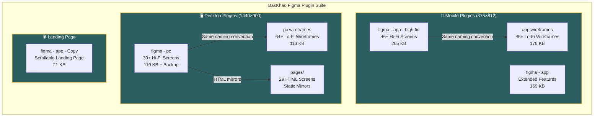
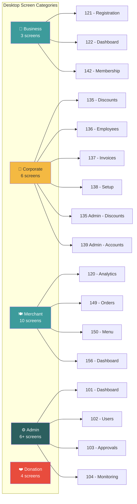
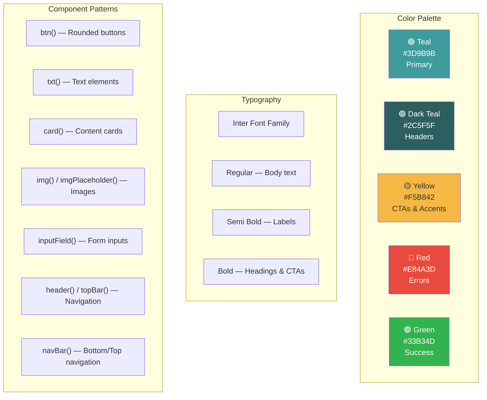
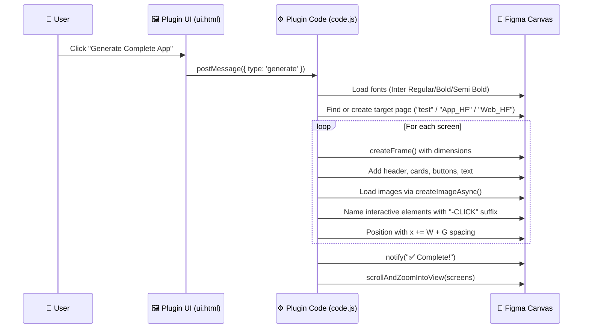
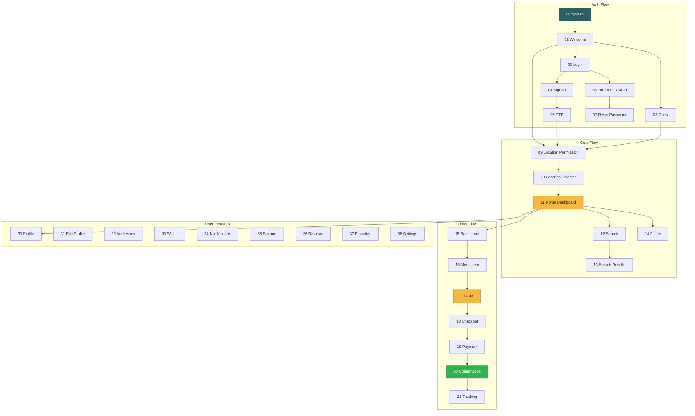
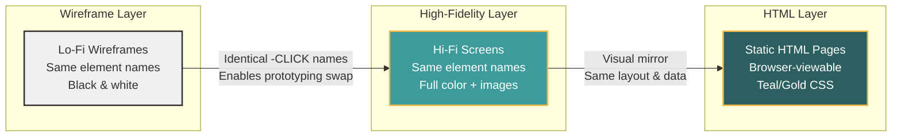

<p align="center">
  
  
  
  
</p>

<h1 align="center">🍕 BasKhao — Figma Screen Generator</h1>

<p align="center">
  <b>A suite of Figma plugins that auto-generate complete, production-ready UI screens for the BasKhao food delivery platform — spanning mobile apps, desktop dashboards, wireframes, landing pages, and admin panels.</b>
</p>

<p align="center">
  <a href="#-architecture-overview">Architecture</a> •
  <a href="#-plugin-modules">Modules</a> •
  <a href="#-screen-catalog">Screens</a> •
  <a href="#-how-it-works">How It Works</a> •
  <a href="#-getting-started">Getting Started</a> •
  <a href="#-design-system">Design System</a>
</p>

---

## 🏗️ Architecture Overview



---

## 📂 Project Structure

```
working figma/
│
├── 📱 figma - app - high fid/     # HIGH-FIDELITY MOBILE APP (Primary)
│   ├── code.js                     # 6,967 lines — 46+ screens with real images
│   ├── ui.html                     # Plugin UI panel
│   ├── manifest.json               # Figma plugin manifest
│   └── dist/                       # Build output
│
├── 📱 figma - app/                 # EXTENDED MOBILE FEATURES
│   ├── code.js                     # 4,665 lines — Pickup, Group Orders, Split Pay
│   ├── ui.html                     # Plugin UI panel
│   ├── manifest.json               # Figma plugin manifest
│   └── dist/                       # Build output
│
├── 📱 app wireframes/              # LOW-FIDELITY MOBILE WIREFRAMES
│   ├── code.js                     # 5,303 lines — Wireframe versions of all screens
│   ├── ui.html                     # Plugin UI panel
│   ├── manifest.json               # Figma plugin manifest
│   └── dist/                       # Build output
│
├── 🖥️ figma - pc/                  # HIGH-FIDELITY DESKTOP DASHBOARD
│   ├── code.js                     # 2,465 lines — Business, Corporate, Merchant, Admin
│   ├── code - backup.js            # 3,757 lines — Full backup with images
│   ├── ui.html                     # Plugin UI panel
│   ├── manifest.json               # With networkAccess for Unsplash images
│   ├── pages/                      # 29 static HTML screen mirrors
│   │   ├── index.html              # Hub page linking all screens
│   │   ├── assets/style.css        # Shared CSS design system
│   │   ├── 101-admin-dashboard.html
│   │   ├── 120-analytics.html
│   │   ├── 135-corporate-discounts.html
│   │   ├── 142-membership.html
│   │   ├── 156-merchant-dashboard.html
│   │   └── ... (29 total screens)
│   └── dist/                       # Build output
│
├── 🖥️ pc wireframes/               # LOW-FIDELITY DESKTOP WIREFRAMES
│   ├── code.js                     # 2,979 lines — 64+ wireframe screens
│   ├── ui.html                     # Plugin UI panel
│   ├── manifest.json               # With networkAccess
│   └── dist/                       # Build output
│
├── 🌐 figma - app - Copy/          # LANDING PAGE GENERATOR
│   ├── code.js                     # 514 lines — Scrollable landing page
│   ├── ui.html                     # Plugin UI panel
│   ├── manifest.json               # Figma plugin manifest
│   └── dist/                       # Build output
│
├── .gitignore
└── README.md                       # ← You are here
```

---

## 🔌 Plugin Modules

### Module 1: 📱 High-Fidelity Mobile App (`figma - app - high fid`)

> **The flagship module** — Generates a complete, production-quality mobile app prototype directly inside Figma.

| Spec | Detail |
|------|--------|
| **Viewport** | 375 × 812 (iPhone X) |
| **Screens** | 46+ fully designed |
| **Features** | 92 features covered |
| **Images** | Real Unsplash photos via `figma.createImageAsync()` |
| **Colors** | Teal/Yellow brand theme with gradients |
| **Typography** | Inter (Regular, Bold, Semi Bold) |
| **Prototyping** | All buttons named with `-CLICK` suffix for Figma prototyping |

**Screen flow covered:**
```
Splash → Welcome → Login/Signup → OTP → Location → Home → Search →
Restaurant → Menu → Cart → Checkout → Tracking → Reviews → Profile →
Wallet → Notifications → Support → Offers → Settings → and more
```

---

### Module 2: 📱 Extended Mobile Features (`figma - app`)

> Adds advanced features that extend the core app — group ordering, split payments, pickup/takeaway flows.

**Key screens:**
- 🚗 Pickup/Takeaway Selection & Notifications
- ⚡ Delivery Type Selection (Standard, Express, Contactless, Curbside)
- 👥 Group Order (Start, Lobby, Finalize)
- 💳 Split Payment (Setup, Status tracking)

---

### Module 3: 📱 Mobile Wireframes (`app wireframes`)

> Low-fidelity wireframe versions of **every mobile screen**, using the **exact same element names** as the high-fidelity versions.

This enables Figma prototyping links to work identically between wireframe and high-fi screens.

**Wireframe Design Language:**
- White fills with black borders (buttons)
- Gray lines as text placeholders
- Gray boxes with X-cross for image placeholders
- Same layout coordinates as high-fidelity screens

---

### Module 4: 🖥️ Desktop Dashboard (`figma - pc`)

> Generates enterprise-grade desktop screens (1440×900) organized by **role-based categories**.



Plus, this module includes **29 static HTML pages** (`pages/`) that mirror the Figma screens for web previewing.

---

### Module 5: 🖥️ Desktop Wireframes (`pc wireframes`)

> **64+ wireframe screens** covering the full web application — the largest module by screen count.

| Category | Screens |
|----------|---------|
| Customer (Web) | 43 screens — Splash through Settings |
| Restaurant (Merchant) | 11 screens — Dashboard through Staff |
| Admin | 10 screens — Dashboard through Analytics |
| **Total** | **64 screens** |

---

### Module 6: 🌐 Landing Page (`figma - app - Copy`)

> Generates a scrollable, multi-section landing page with **real Unsplash images**.

**Sections (4800px total height):**
1. **Hero** (900px) — CTA, feature cards, customer badges
2. **How It Works** (600px) — 3-step flow cards
3. **Featured Restaurants** (650px) — Real food photos
4. **Popular Dishes** (700px) — Category tabs + dish cards
5. **Delivery Riders** (550px) — USP section
6. **Customer Reviews** (500px) — Testimonial cards
7. **Footer** (600px) — Newsletter, links, app badges

---

## 🎨 Design System

All plugins share a unified visual language:



### Shared Helper Functions

Every plugin reuses the same core helper API:

| Function | Purpose | Used In |
|----------|---------|---------|
| `btn(parent, name, x, y, w, h, color, text, fontSize)` | Create styled button with text | All modules |
| `txt(parent, text, x, y, size, color, style)` | Create text element | All modules |
| `card(parent, x, y, w, h, color)` | Create rounded rectangle card | Desktop modules |
| `inputField(parent, x, y, w, h, placeholder)` | Create form input with placeholder | Mobile modules |
| `img(parent, x, y, w, h, url)` | Load real image from URL | Hi-fi modules |
| `imgPlaceholder(parent, x, y, w, h, query)` | Gray box with label | Desktop modules |
| `imgWire(parent, x, y, w, h)` | Gray box with X-cross diagonal | Wireframe modules |
| `btnWire(parent, name, x, y, w, h)` | White button with black border | Wireframe modules |
| `header()` / `topBar()` / `navBar()` | Navigation bars | All modules |
| `notificationBar(parent)` | iPhone status bar (9:41, battery, signal) | Mobile modules |

---

## ⚡ How It Works



### Plugin Communication Flow

```
┌─────────────────────┐     postMessage      ┌─────────────────────┐
│                     │    ──────────────►    │                     │
│      ui.html        │    { type: 'generate' }│      code.js        │
│   (Plugin Panel)    │                      │   (Figma Sandbox)   │
│                     │    ◄──────────────    │                     │
│  • "Generate" button│    figma.notify()     │  • Figma API calls  │
│  • Teal/Gold theme  │                      │  • Font loading     │
│  • Feature summary  │                      │  • Screen creation  │
└─────────────────────┘                      └─────────────────────┘
```

---

## 🚀 Getting Started

### Prerequisites

- [Figma Desktop App](https://www.figma.com/downloads/) (or web browser)
- A Figma account

### Installation

1. **Clone this repository:**
   ```bash
   git clone https://github.com/MaazSohail11/Figma-Screen-generator.git
   ```

2. **Open Figma** and go to: `Plugins → Development → Import plugin from manifest...`

3. **Select a `manifest.json`** from any module folder:
   - `figma - app - high fid/manifest.json` for mobile hi-fi screens
   - `figma - pc/manifest.json` for desktop dashboard screens
   - `app wireframes/manifest.json` for mobile wireframes
   - `pc wireframes/manifest.json` for desktop wireframes
   - `figma - app - Copy/manifest.json` for landing page
   - `figma - app/manifest.json` for extended mobile features

4. **Run the plugin** → Click "🚀 Generate Complete App"

5. **Wait for generation** (may take 30-60 seconds for image-heavy modules)

### Quick Start: Which module to load first?

| Your Goal | Load This Module |
|-----------|-----------------|
| See the complete mobile app | `figma - app - high fid` |
| Design review with stakeholders | `app wireframes` → then `figma - app - high fid` |
| Build merchant/admin dashboards | `figma - pc` |
| Preview screens in browser | Open `figma - pc/pages/index.html` |
| Generate a marketing landing page | `figma - app - Copy` |

---

## 🗺️ Complete Screen Map

### Mobile App Screens (46+)



### Desktop Dashboard Screens (30+)

| # | Screen Name | Category | Key Features |
|---|-------------|----------|--------------|
| 101 | Admin Dashboard | Admin | Overview, metrics, quick actions |
| 102 | User Management | Admin | CRUD users, search, roles |
| 103 | Restaurant Approvals | Admin | Approve/reject applications |
| 104 | Order Monitoring | Admin | Live order tracking |
| 105 | Platform Settings | Admin | Config & preferences |
| 106 | Reports & Analytics | Admin | Charts, exports |
| 120 | Analytics Dashboard | Merchant | Revenue, orders, trends |
| 121 | Business Registration | Business | Multi-step form |
| 122 | Business Dashboard | Business | Overview, team, invoices |
| 135 | Corporate Discounts | Corporate | Discount rules, checkout preview |
| 136 | Employee Management | Corporate | Add/remove, search, filters |
| 137 | Invoice History | Corporate | Monthly invoices, export |
| 138 | Corporate Account Setup | Corporate | 3-step registration |
| 139 | Corporate Accounts (Admin) | Admin | Manage all corps |
| 142 | Membership & Subscription | Business | Silver/Gold plans |
| 149 | Order Management | Merchant | Active orders, status |
| 150 | Menu Management | Merchant | CRUD menu items |
| 151 | Staff Management | Merchant | Team members |
| 152 | Payouts & Earnings | Merchant | Revenue, withdrawals |
| 153 | Sales Reports | Merchant | Revenue analytics |
| 154 | Review Management | Merchant | Customer reviews |
| 156 | Merchant Dashboard | Merchant | Overview & stats |
| 157 | Restaurant Profile | Merchant | Edit profile |
| 158 | Promotions & Offers | Merchant | Create promos |
| 137 | Community Food Share | Donation | Donation hub |
| 138a | Donate Your Food | Donation | Confirm donation |
| 138b | Select Charity | Donation | Choose organization |
| 138c | Schedule Pickup | Donation | Pickup scheduling |

---

## 🔗 How Wireframes Connect to High-Fidelity



**Key Design Decision:** All interactive elements across wireframe and high-fidelity modules share **identical names** (e.g., `LoginBtn-CLICK`, `SearchBar-CLICK`). This means prototyping links created in one layer transfer seamlessly to the other.

---

## 📊 Project Statistics

| Metric | Value |
|--------|-------|
| **Total Plugins** | 6 |
| **Total JS Lines** | ~27,000+ |
| **Total Screens (Hi-Fi)** | 76+ (mobile) + 30+ (desktop) |
| **Total Screens (Wireframe)** | 46+ (mobile) + 64+ (desktop) |
| **Total Screens (HTML)** | 29 |
| **Grand Total Screens** | **~200+ unique screens** |
| **Features Covered** | 92+ |
| **User Roles** | Customer, Merchant, Corporate, Admin |
| **Font** | Inter (3 weights) |
| **Color Theme** | Teal (#3D9B9B) + Yellow (#F4B942) |
| **Image Sources** | Unsplash (real images) |

---

## 🛠️ Technical Deep-Dive

### Plugin Manifest Structure

```json
{
  "name": "BasKhao Complete App",
  "id": "999999999",
  "api": "1.0.0",
  "main": "code.js",
  "ui": "ui.html",
  "editorType": ["figma"],
  "networkAccess": {
    "allowedDomains": [
      "https://images.unsplash.com",
      "https://randomuser.me",
      "https://fonts.googleapis.com",
      "https://fonts.gstatic.com"
    ]
  }
}
```

### Image Loading Strategy

```javascript
// Hi-Fi: Real images from Unsplash
async function img(parent, x, y, w, h, url) {
  try {
    const image = await figma.createImageAsync(url);
    rect.fills = [{ type: 'IMAGE', scaleMode: 'FILL', imageHash: image.hash }];
  } catch {
    // Fallback: gray placeholder with emoji
    rect.fills = [{ type: 'SOLID', color: { r: 0.7, g: 0.7, b: 0.7 } }];
  }
}

// Wireframe: Gray box with X-cross
function imgWire(parent, x, y, w, h) {
  // Gray rectangle + diagonal lines forming an X
}
```

### Screen Positioning Algorithm

```javascript
// Mobile: Linear horizontal layout
let x = 0;
const W = 375, H = 812, G = 100;
// Each screen: x += W + G

// Desktop: Grid layout with rows
let rowY = 0, colX = 0;
const W = 1440, H = 900, G = 150, ROW_GAP = 200;
// New row: colX = 0; rowY += H + ROW_GAP;
```

---

## 🤝 Contributing

1. Fork this repository
2. Create your feature branch (`git checkout -b feature/new-screen`)
3. Add your screen code to the appropriate `code.js`
4. Follow the naming convention: `ScreenName-CLICK` for interactive elements
5. Commit your changes (`git commit -m 'Add new screen: Feature Name'`)
6. Push to the branch (`git push origin feature/new-screen`)
7. Open a Pull Request

---

## 📄 License

This project is open source and available for educational and commercial use.

---

<p align="center">
  <b>BasKhao © 2025 — Food Delivery Platform</b><br/>
  <sub>Built with ❤️ using the Figma Plugin API</sub>
</p>
